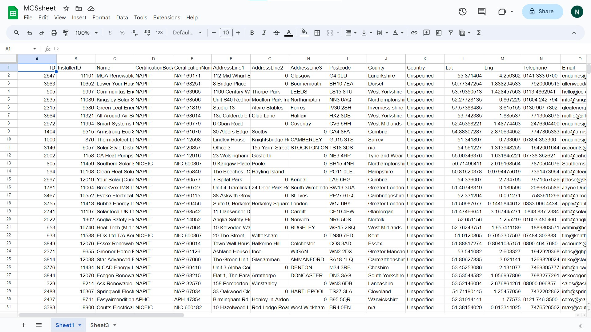
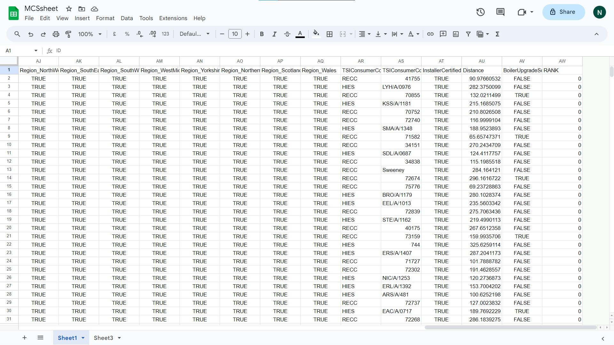

# MCSCertified Data Scraper and Google Sheets Uploader

This project is designed to scrape data from mcscertified.com using the Beautiful Soup and Requests libraries in Python. The scraped data is then uploaded to a Google Sheets spreadsheet using the Google Sheets API.

View Google Sheet
```https://docs.google.com/spreadsheets/d/1FUWLvNpgekxCzaI-1uwKPl_R3sT3vx-rzT4TxnWy080/edit?usp=sharing```


## Table of Contents

- [Introduction](#introduction)
- [Requirements](#requirements)
- [Installation](#installation)
- [Usage](#usage)
- [Configuration](#configuration)
- [Contributing](#contributing)
- [License](#license)

## Introduction

The MCSCertified Data Scraper and Google Sheets Uploader is a Python script that automates the process of collecting data from mcscertified.com and storing it in a Google Sheets spreadsheet. This can be useful for various purposes, such as tracking certifications, analyzing trends, and more.

## Requirements

- Python 3.x
- Beautiful Soup
- Requests
- Google API Client

You can install the required Python packages using the following command:

```pip install beautifulsoup4 requests google-api-python-client google-auth-httplib2 google-auth-oauthlib```


## Installation

1. Clone this repository to your local machine.
2. Create a virtual environment (optional but recommended).
3. Install the required packages as mentioned in the "Requirements" section.

## Usage

1. Obtain API credentials for the Google Sheets API by creating a project on the Google Cloud Console and enabling the Google Sheets API.
2. Download the credentials JSON file and save it in the project directory.
3. Rename the credentials JSON file to `credentials.json`.

Run the Python notebook ```scraper.ipynb``` to scrape the data and connect to the Google sheets and it is handled by 
```googleSheetsHandler``` class 

```googleSheetsHandler``` class has multiple functionalites

    1.connector : Validates and connects to the google Sheet and returns the service
    2.insertData : Inserts the data into google sheets and takes input in form of list
    3.readData : Reads data from google sheet
    4.createSheet : Creates a brand new sheet takes user input for sheet name with new spreadsheet id and title
    5.removeAllDataFromSheet : Clears all the data that is present in google sheet 


The script will scrape data from mcscertified.com and upload it to a specified Google Sheets spreadsheet.

## Configuration

Before running the script, you need to configure the following parameters in the `config.py` file:

- `SPREADSHEET_ID`: The ID of the Google Sheets spreadsheet where you want to upload the data.
- `SHEET_NAME`: The name of the sheet within the spreadsheet where the data should be inserted.





## Contributing

Contributions to this project are welcome! If you find any issues or want to add new features, feel free to open a pull request.

## License

Feel free to use and understand the project any suggestions are welcomed :)
